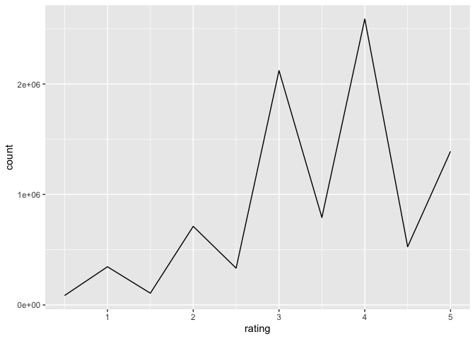

Report on MovieLens Project
================
Anh N.H. Nguyen
10/19/2019

## Introduction

This is a report on the MovieLens project. The data was obtained from
[the GroupLens research
lab](https://grouplens.org/datasets/movielens/latest/).

We are going to use the following library:

``` r
library(tidyverse)
library(caret)
```

## MovieLens 10M dataset and edex/validation partition

    ## Warning in set.seed(1, sample.kind = "Rounding"): non-uniform 'Rounding'
    ## sampler used

    ## Joining, by = c("userId", "movieId", "rating", "timestamp", "title", "genres")

## Overview

edX dataset includes 6 features of 9,000,055 observations. Validation
dataset has similar features of 999,999 observations.

    ## Observations: 9,000,055
    ## Variables: 6
    ## $ userId    <int> 1, 1, 1, 1, 1, 1, 1, 1, 1, 1, 1, 1, 1, 1, 1, 1, 1, 1, …
    ## $ movieId   <dbl> 122, 185, 292, 316, 329, 355, 356, 362, 364, 370, 377,…
    ## $ rating    <dbl> 5, 5, 5, 5, 5, 5, 5, 5, 5, 5, 5, 5, 5, 5, 5, 5, 5, 5, …
    ## $ timestamp <int> 838985046, 838983525, 838983421, 838983392, 838983392,…
    ## $ title     <chr> "Boomerang (1992)", "Net, The (1995)", "Outbreak (1995…
    ## $ genres    <chr> "Comedy|Romance", "Action|Crime|Thriller", "Action|Dra…

    ## Observations: 999,999
    ## Variables: 6
    ## $ userId    <int> 1, 1, 1, 2, 2, 2, 3, 3, 4, 4, 4, 5, 5, 5, 5, 5, 5, 5, …
    ## $ movieId   <dbl> 231, 480, 586, 151, 858, 1544, 590, 4995, 34, 432, 434…
    ## $ rating    <dbl> 5.0, 5.0, 5.0, 3.0, 2.0, 3.0, 3.5, 4.5, 5.0, 3.0, 3.0,…
    ## $ timestamp <int> 838983392, 838983653, 838984068, 868246450, 868245645,…
    ## $ title     <chr> "Dumb & Dumber (1994)", "Jurassic Park (1993)", "Home …
    ## $ genres    <chr> "Comedy", "Action|Adventure|Sci-Fi|Thriller", "Childre…

    ##      userId         movieId          rating        timestamp        
    ##  Min.   :    1   Min.   :    1   Min.   :0.500   Min.   :7.897e+08  
    ##  1st Qu.:18124   1st Qu.:  648   1st Qu.:3.000   1st Qu.:9.468e+08  
    ##  Median :35738   Median : 1834   Median :4.000   Median :1.035e+09  
    ##  Mean   :35870   Mean   : 4122   Mean   :3.512   Mean   :1.033e+09  
    ##  3rd Qu.:53607   3rd Qu.: 3626   3rd Qu.:4.000   3rd Qu.:1.127e+09  
    ##  Max.   :71567   Max.   :65133   Max.   :5.000   Max.   :1.231e+09  
    ##     title              genres         
    ##  Length:9000055     Length:9000055    
    ##  Class :character   Class :character  
    ##  Mode  :character   Mode  :character  
    ##                                       
    ##                                       
    ## 

## Ratings General

No user gives 0 as a rating. Half-star ratings are less common than
whole-star ratings. Top 5 ratings are: 4, 3, 5, 3.5 and 2.

<!-- -->

## Ratings by Genres

Top 5 rated genres are: Drama, Comedy, Action, Thriller, and Adventure

    ## # A tibble: 20 x 2
    ##    genres               count
    ##    <chr>                <int>
    ##  1 Drama              3910127
    ##  2 Comedy             3540930
    ##  3 Action             2560545
    ##  4 Thriller           2325899
    ##  5 Adventure          1908892
    ##  6 Romance            1712100
    ##  7 Sci-Fi             1341183
    ##  8 Crime              1327715
    ##  9 Fantasy             925637
    ## 10 Children            737994
    ## 11 Horror              691485
    ## 12 Mystery             568332
    ## 13 War                 511147
    ## 14 Animation           467168
    ## 15 Musical             433080
    ## 16 Western             189394
    ## 17 Film-Noir           118541
    ## 18 Documentary          93066
    ## 19 IMAX                  8181
    ## 20 (no genres listed)       7

## Movies Rankings

Top rated movies are: Pulp Fiction, Forrest Gump, Silence of the Lambs,
Jurassic Park, etc.

    ## # A tibble: 10,677 x 3
    ## # Groups:   movieId [10,677]
    ##    movieId title                                                      count
    ##      <dbl> <chr>                                                      <int>
    ##  1     296 Pulp Fiction (1994)                                        31362
    ##  2     356 Forrest Gump (1994)                                        31079
    ##  3     593 Silence of the Lambs, The (1991)                           30382
    ##  4     480 Jurassic Park (1993)                                       29360
    ##  5     318 Shawshank Redemption, The (1994)                           28015
    ##  6     110 Braveheart (1995)                                          26212
    ##  7     457 Fugitive, The (1993)                                       25998
    ##  8     589 Terminator 2: Judgment Day (1991)                          25984
    ##  9     260 Star Wars: Episode IV - A New Hope (a.k.a. Star Wars) (19… 25672
    ## 10     150 Apollo 13 (1995)                                           24284
    ## # … with 10,667 more rows
